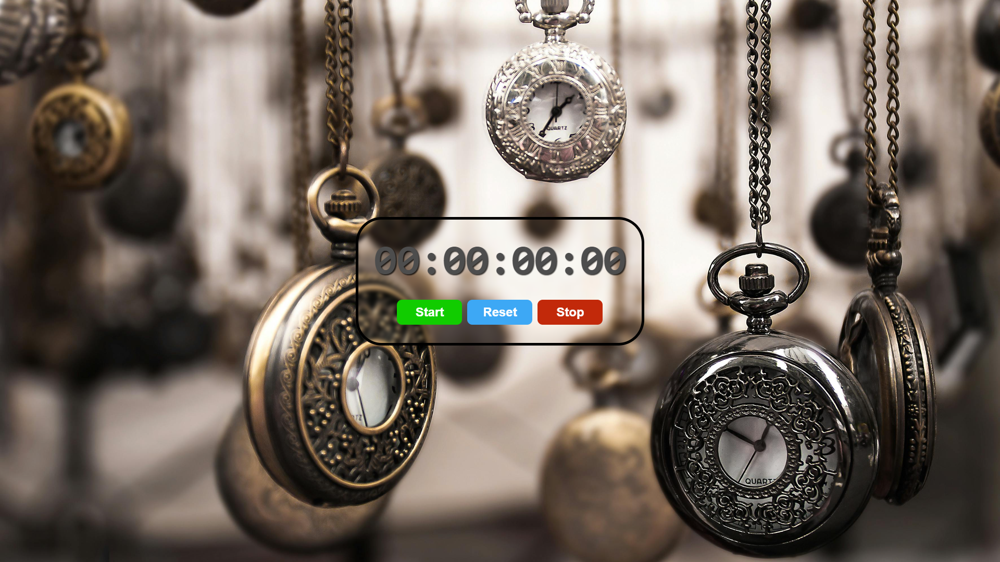

# Stopwatch

A simple stopwatch application built with React. This project demonstrates the use of React hooks to manage state and side effects.

## Display



## Features

- Start, stop, and reset the timer
- Displays elapsed time in hours, minutes, seconds, and milliseconds
- Responsive UI with basic controls

## Technologies Used

- React
- JavaScript
- CSS

## Installation

To run the stopwatch application locally, follow these steps:

1. Clone the repository:

   ```bash
   git clone <repository-url>

   ```

2. Navigate to the project directory:

   ```bash
   cd react.js-stop-watch

   ```

3. Install the dependencies:

   ```bash
   npm install

   ```

4. Start the development server:
   ```bash
   npm run dev
   ```

## Usage

- The DigitalClock component can be used in any React application. Simply import it and include it in your JSX:
  ```javascript
  import StopWatch from "./StopWatch";
  function App() {
    return (
      <div>
        <StopWatch />
      </div>
    );
  }
  ```

## Technologies Used

- React.js
- JavaScript (ES6)
- CSS (for styling)

## Contributing

- Contributions are welcome! If you have suggestions for improvements or features, feel free to open an issue or submit a pull request.

## Acknowledgments

Photo by [Giallo](https://www.pexels.com/photo/assorted-silver-colored-pocket-watch-lot-selective-focus-photo-859895/) from Pexels.


## License

- This project is open-source and available under the MIT License.
